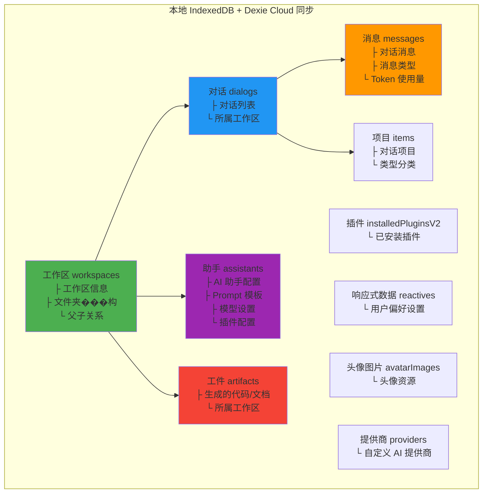
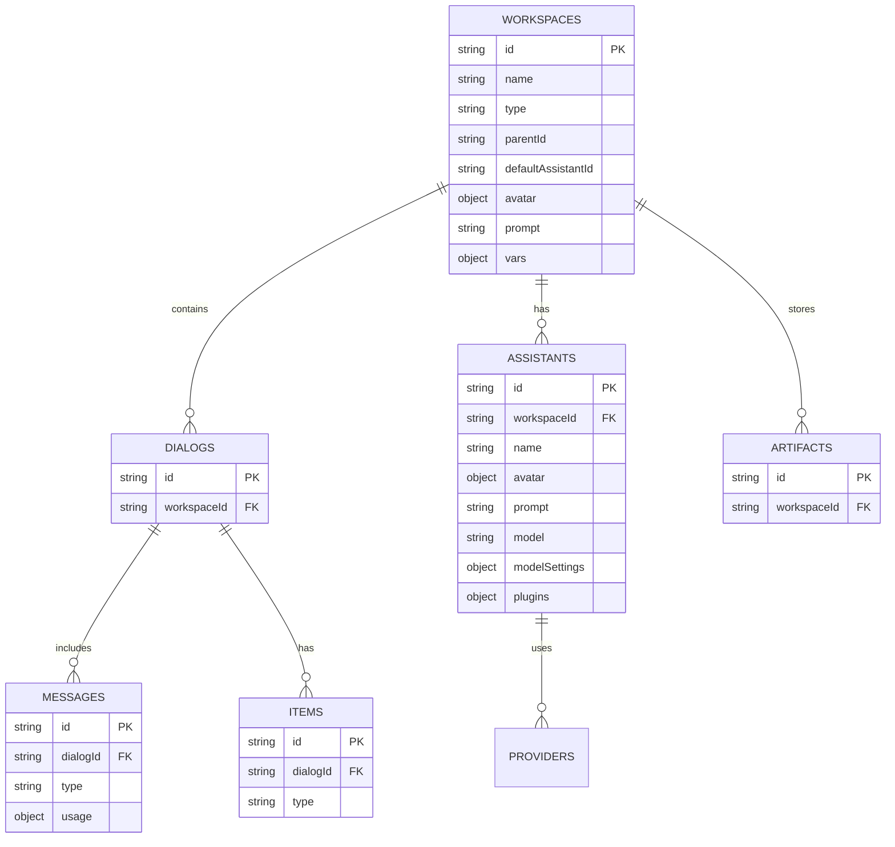
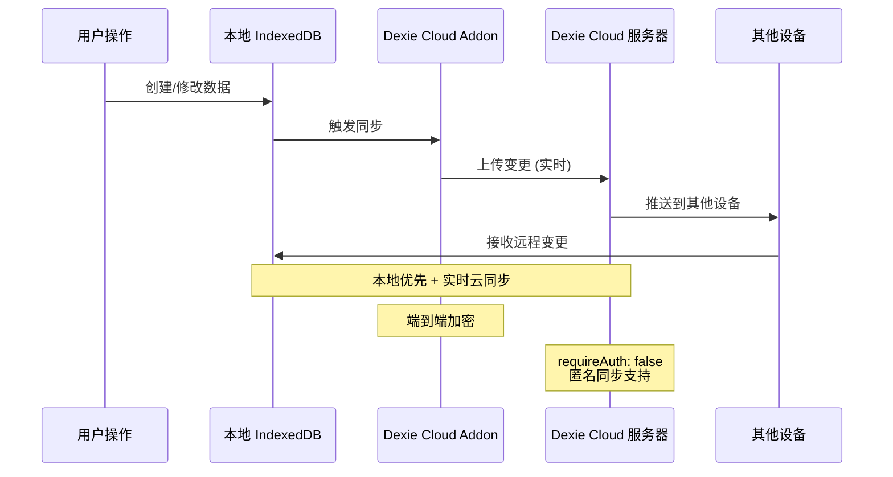

# AIaW 数据同步架构

## 同步的数据表

## 数据关系图

## 同步机制

## 数据统计

| 数据表 | 用途 | 索引字段 | 同步状态 |
|--------|------|----------|----------|
| **workspaces** | 工作区/文件夹 | id, type, parentId | ✅ 云同步 |
| **dialogs** | 对话会话 | id, workspaceId | ✅ 云同步 |
| **messages** | 聊天消息 | id, type, dialogId | ✅ 云同步 |
| **assistants** | AI 助手配置 | id, workspaceId | ✅ 云同步 |
| **artifacts** | 生成的工件 | id, workspaceId | ✅ 云同步 |
| **installedPluginsV2** | 插件 | key, id | ✅ 云同步 |
| **reactives** | 响应式设置 | key | ✅ 云同步 |
| **avatarImages** | 头像图片 | id | ✅ 云同步 |
| **items** | 对话项目 | id, type, dialogId | ✅ 云同步 |
| **providers** | 自定义提供商 | id | ✅ 云同步 |

**总计：10 个同步表**

## 配置说明

- **同步引擎**: Dexie Cloud Addon
- **数据库名**: `data`
- **版本**: v6
- **认证模式**: 免认证 (`requireAuth: false`)
- **自定义登录**: 启用 (`customLoginGui: true`)
- **数据库 URL**: 从 `DexieDBURL` 配置读取
